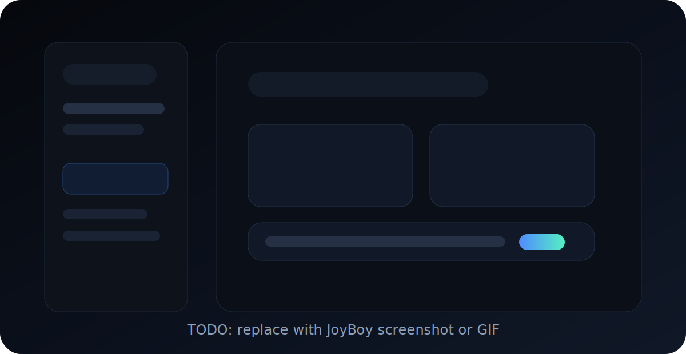
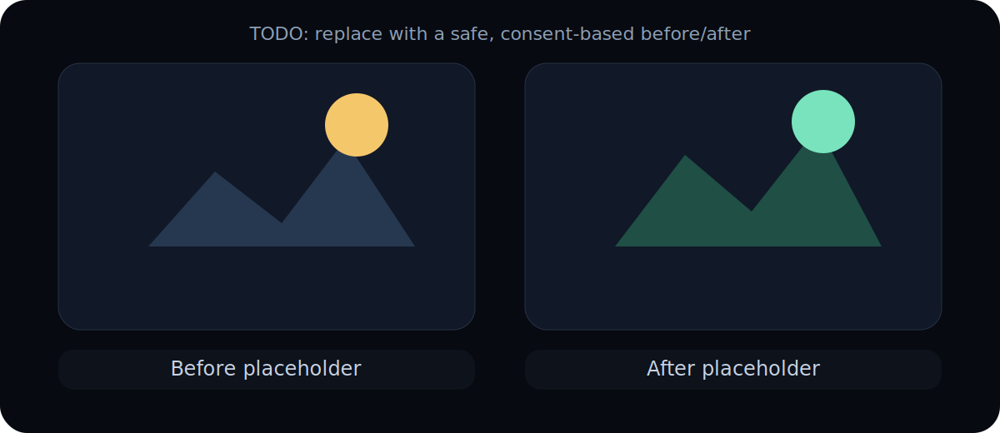

# JoyBoy - Local AI Workstation and Harness

**JoyBoy is a local-first AI workstation and harness: a private ChatGPT / Grok-style chat app with image generation, image editing, video experiments, Ollama support, model imports, local addons, model/runtime orchestration, and a Codex-style project mode in development.**

[](LICENSE)
[](scripts/requirements.txt)
[](#why-joyboy)
[](#local-secrets)
[](#features)

Run AI chat, image workflows, model management, and local creative tools on your own machine. JoyBoy is built for people who want an open source ChatGPT alternative, an offline AI assistant, a local Stable Diffusion / SDXL interface, and a privacy-focused AI harness without relying on a cloud account.



> Replace this placeholder with a short GIF or screenshot showing: prompt -> preview -> result.

## Features

- **Private local AI chat** with Ollama and local model routing.
- **Local AI harness** for routing prompts, tools, jobs, models, runtime state, and optional extensions from one app.
- **Text-to-image generation** with local image models and provider imports.
- **Image editing and inpainting** for background edits, clothing edits, lighting, brush masks, expand/outpaint, and detail fixes.
- **Video experiments** for local image-to-video workflows on consumer GPUs.
- **Model importer** for Hugging Face and CivitAI sources, with local runtime profiles and 8 GB VRAM-aware defaults.
- **Local addons / packs** that can extend routing rules, prompt assets, model sources, and UI surfaces without polluting the public core.
- **Gallery and metadata** for generated images/videos, prompts, models, and local artifacts.
- **Doctor and runtime panels** for VRAM/RAM state, loaded models, provider keys, and machine readiness.
- **Project mode in development** for Codex / Claude Code-style workspace-aware assistance and terminal tools.

## Why JoyBoy

JoyBoy is designed for local AI users who care about privacy, control, and hardware limits.

- **Zero cloud by default**: chats, outputs, provider secrets, and optional packs stay on your computer.
- **One local app**: chat, image generation, video tests, model picker, gallery, local packs, and runtime status live together.
- **Harness mindset**: JoyBoy coordinates models, jobs, tools, providers, and packs instead of leaving each workflow as a separate script.
- **Consumer GPU friendly**: profiles target real machines, including 8 GB VRAM setups.
- **Open source core**: the public repository ships the neutral local AI workstation; optional packs remain separate.
- **Extensible by design**: addons can add workflows without turning the core app into a private monolith.

## Use Cases

- Run a local ChatGPT-like or Grok-like assistant with Ollama.
- Use a local LLM harness to coordinate chat, tools, model routing, and creative jobs.
- Generate images locally with SDXL, Flux-style workflows, and imported checkpoints.
- Edit photos with inpainting, brush masks, background changes, lighting changes, and outpainting.
- Test local image-to-video workflows without a hosted AI platform.
- Manage Hugging Face and CivitAI model sources from a local UI.
- Build local addons for custom routing, prompts, model presets, and creator workflows.
- Experiment with a local Codex-style dev assistant that can understand a project workspace.

## Demo



Good public demo assets:

- a short GIF showing prompt -> preview -> final image;
- a safe before/after edit with non-sensitive content;
- screenshots of onboarding, Doctor, model picker, gallery, and local addons.

Keep public README media safe, consent-based, and non-explicit.

## Quick Start

Clone the repository, then run the launcher for your platform.

### Windows

Double-click `start_windows.bat` or run:

```bat
start_windows.bat
```

### macOS

```bash
./start_mac.command
```

### Linux

```bash
./start_linux.sh
```

Then open:

```text
http://127.0.0.1:7860
```

On first launch, JoyBoy runs onboarding, detects your machine profile, and shows a Doctor report if something is missing. The launchers include a first-time setup/repair path and a fast start path.

## Local Secrets

Provider keys are optional and stay local:

- `HF_TOKEN`
- `CIVITAI_API_KEY`
- `OLLAMA_BASE_URL`

Set them through environment variables, a local `.env`, or the JoyBoy settings UI. UI-managed secrets are stored outside git in:

```text
~/.joyboy/config.json
```

The public repo only ships placeholders such as `HF_TOKEN=` and `CIVITAI_API_KEY=`. You only need provider keys for downloads that require them, for example gated Hugging Face models or CivitAI model imports. If you already use local models only, you can start without keys and add them later in the UI.

## Public Core + Local Packs

JoyBoy separates the open source core from optional local extensions.

The public core includes orchestration, routing, onboarding, Doctor checks, model/provider import flows, gallery UI, runtime storage, and pack validation.

Local packs live in:

```text
~/.joyboy/packs/<pack_id>/
```

Some optional local packs may target mature or adult workflows where legal, consensual, and compliant with platform policies. These packs are not part of the public core.

See [Local Packs](docs/LOCAL_PACKS.md), [Addons](docs/ADDONS.md), and [Third-Party Packs](docs/THIRD_PARTY_PACKS.md) for the pack contract.

## Documentation

- [Getting Started](docs/GETTING_STARTED.md)
- [Architecture](docs/ARCHITECTURE.md)
- [Local Packs](docs/LOCAL_PACKS.md)
- [Addons and Pack Templates](docs/ADDONS.md)
- [Third-Party Packs](docs/THIRD_PARTY_PACKS.md)
- [VRAM Management](docs/VRAM_MANAGEMENT.md)
- [Security and Content Policy](docs/SECURITY_AND_CONTENT_POLICY.md)
- [Repository SEO and Discovery](docs/SEO_AND_DISCOVERY.md)
- [Good First Issues](docs/GOOD_FIRST_ISSUES.md)

## Contributing

Start with [CONTRIBUTING.md](CONTRIBUTING.md), [ROADMAP.md](ROADMAP.md), and [docs/GOOD_FIRST_ISSUES.md](docs/GOOD_FIRST_ISSUES.md).

Good early contributions include docs, Doctor checks, UI polish, model import UX, tests around local packs, and release hygiene.

## License

Apache License 2.0. See [LICENSE](LICENSE).
