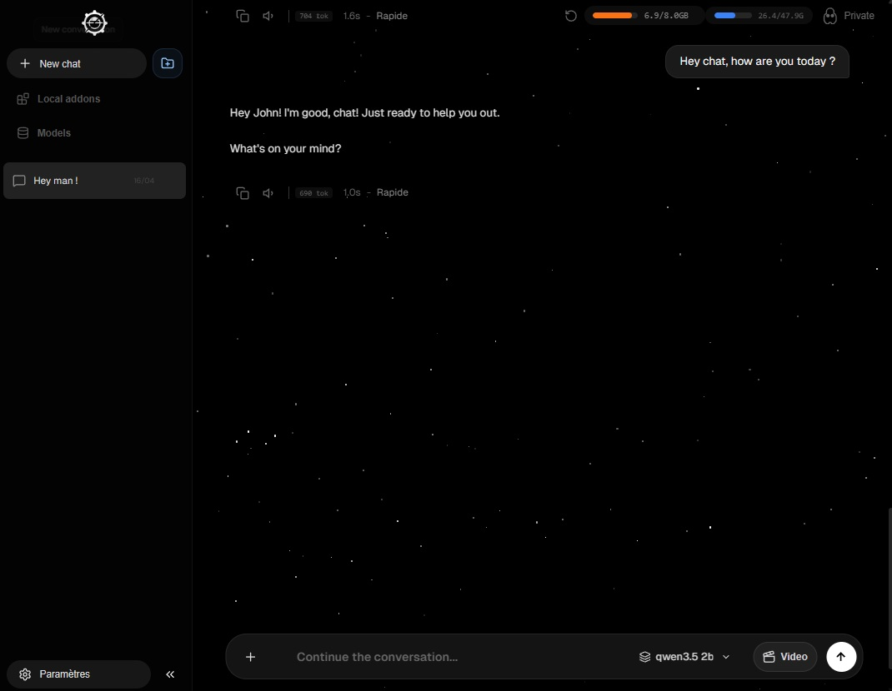
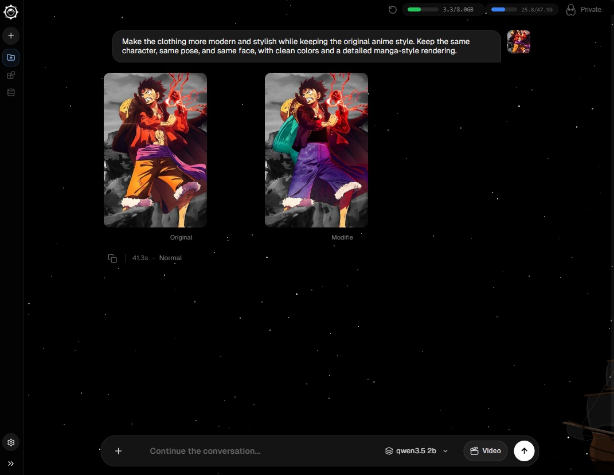
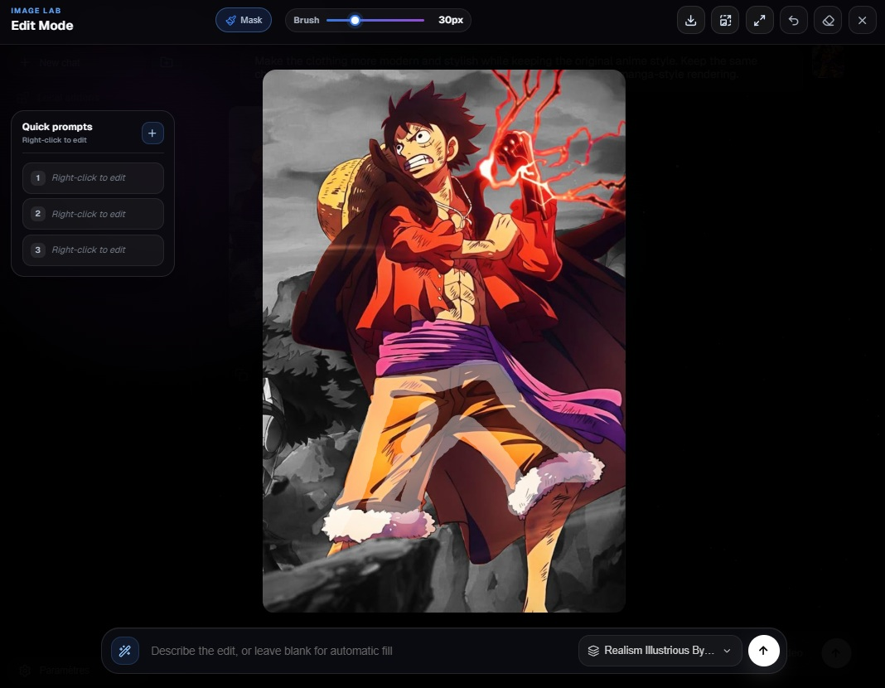
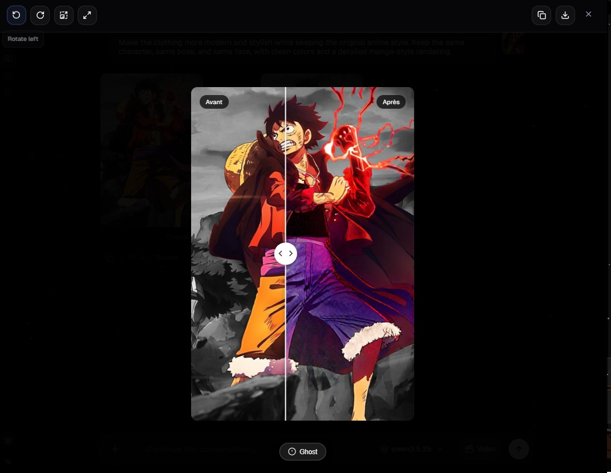

# JoyBoy - Local-First SuperAgent Harness for Chat, Code, Image, and Video

**JoyBoy is an open-source local-first SuperAgent-style AI harness that chats, researches, codes, and creates. With workspace tools, model orchestration, optional cloud/API and CLI account connectors, local packs and skills, Doctor checks, image generation, SDXL inpainting, and video workflows, it turns a consumer workstation into a private multimodal AI cockpit.**

[](LICENSE)
[](scripts/requirements.txt)
[](#why-joyboy)
[](#local-secrets-and-providers)
[](#features)

Run AI chat, web research, project-aware coding tools, image workflows, model management, and local creative tools on your own machine. JoyBoy is built for people who want an open source ChatGPT alternative, an offline AI assistant, a local Stable Diffusion / SDXL interface, and a privacy-focused agent harness without relying on a cloud account by default. When you do want cloud models, JoyBoy can also connect provider APIs and supported local CLI/OAuth accounts from the same UI.

JoyBoy is especially aimed at long-tail local AI workflows: **local-first SuperAgent harness**, **local AI workstation**, **workspace-aware coding agent**, **local AI image editor**, **Ollama image generation routing**, **SDXL inpainting UI**, **CivitAI model imports**, and **8GB VRAM Stable Diffusion / SDXL workflows** on consumer hardware.

## Preview

| Local chat and runtime | Image edit result |
| --- | --- |
|  |  |

| Edit mode | Before/after viewer |
| --- | --- |
|  |  |

## Features

- **Private local AI chat** with Ollama UI controls and local model routing.
- **Optional cloud LLM providers** for chat and terminal agent mode, including OpenAI, Anthropic / Claude, Google Gemini, OpenRouter, DeepSeek, Moonshot / Kimi K2, MiniMax, Novita AI, Volcengine / Doubao, Zhipu / GLM, and OpenAI-compatible vLLM servers.
- **Account connector modes** for supported developer subscriptions, including Codex CLI and Claude Code OAuth handoffs when those tools are already authenticated locally.
- **Local-first agent harness** for routing prompts, tools, jobs, models, runtime state, and optional extensions from one app.
- **Project mode** for Codex / Claude Code-style workspace assistance, bounded repo analysis, deferred tool discovery, terminal todos, and tool execution.
- **Local AI workstation** that keeps chat, image generation, image editing, video tests, gallery, model imports, and runtime panels together.
- **Web research and tool workflows** through provider-backed search/fetch tools, local skills, and pack-based extensions.
- **Text-to-image generation** with local image models, Ollama-assisted routing, and provider imports.
- **Local AI image editor / SDXL inpainting UI** for background edits, clothing edits, lighting, brush masks, expand/outpaint, and detail fixes.
- **Video experiments** for local image-to-video workflows on consumer GPUs.
- **CivitAI model imports and Hugging Face imports** with local runtime profiles and 8GB VRAM-aware Stable Diffusion / SDXL defaults.
- **Local addons / packs** that can extend routing rules, prompt assets, model sources, and UI surfaces without polluting the public core.
- **Gallery and metadata** for generated images/videos, prompts, models, and local artifacts.
- **Doctor and runtime panels** for VRAM/RAM state, loaded models, provider keys, and machine readiness.

## Why JoyBoy

JoyBoy is designed for local AI users who care about privacy, control, and hardware limits.

- **Zero cloud by default**: chats, outputs, provider secrets, and optional packs stay on your computer.
- **Bring your own provider**: stay fully local, use API keys, or switch to supported CLI/OAuth account connectors without mixing billing modes.
- **One local app**: chat, image generation, video tests, model picker, gallery, local packs, and runtime status live together.
- **Harness mindset**: JoyBoy coordinates models, jobs, tools, providers, and packs instead of leaving each workflow as a separate script.
- **Consumer GPU friendly**: profiles target real machines, including 8 GB VRAM setups.
- **Open source core**: the public repository ships the neutral local AI workstation; optional packs remain separate.
- **Extensible by design**: addons can add workflows without turning the core app into a private monolith.

## Use Cases

- Run a local ChatGPT-like or Grok-like assistant with Ollama.
- Switch chat and project mode between local Ollama models, OpenAI GPT, Claude, Gemini, Kimi K2, OpenRouter models, and local OpenAI-compatible servers.
- Use Codex CLI or Claude Code account handoffs for dev-agent workflows when those connectors are available on your machine.
- Use a local LLM harness and local AI harness to coordinate chat, tools, model routing, and creative jobs.
- Use JoyBoy as a local AI workstation for chat, image generation, image editing, runtime jobs, and model management.
- Generate images locally with SDXL, Flux-style workflows, Ollama-assisted routing, and imported checkpoints.
- Edit photos in a local AI image editor with SDXL inpainting, brush masks, background changes, lighting changes, and outpainting.
- Test local image-to-video workflows without a hosted AI platform.
- Manage Hugging Face and CivitAI model imports from a local UI.
- Run 8GB VRAM Stable Diffusion / SDXL workflows with profiles designed for consumer GPUs.
- Build local addons for custom routing, prompts, model presets, and creator workflows.
- Experiment with a local Codex-style dev assistant that can understand a project workspace, search the web, and use tools without exposing every schema every turn.

## Quick Start

Clone the repository, then run the launcher for your platform.

### Windows

Double-click `start_windows.bat` or run:

```bat
start_windows.bat
```

### macOS

```bash
chmod +x start_mac.command
./start_mac.command
```

If macOS says the launcher is not executable, run the `chmod +x` command above once from Terminal, then launch it again.

### Linux

```bash
./start_linux.sh
```

Then open:

```text
http://127.0.0.1:7860
```

On first launch, JoyBoy runs onboarding, detects your machine profile, and shows a Doctor report if something is missing. The launchers include a first-time setup/repair path and a fast start path.

The first inpaint, text-to-image, or video run can take longer than the next ones. JoyBoy may need to download or prepare missing runtime assets such as segmentation checkpoints, SCHP human parsing files, ControlNet helpers, preview VAEs, or video components. The generation card shows setup/download progress while this happens; once cached locally, later generations reuse those assets.

If you have an NVIDIA GPU (RTX, GTX, or compatible pro card) but JoyBoy logs `0.0GB VRAM` or `torch ... +cpu`, run the Windows launcher and choose **Setup complet**. That repairs the local virtual environment and reinstalls PyTorch with CUDA support. Machines without CUDA/MPS can still start JoyBoy for chat, providers, local packs, imports, and lighter tools, but heavy local image/video generation will be limited.

## Local Secrets and Providers

Provider keys are optional and stay local:

- `HF_TOKEN`
- `CIVITAI_API_KEY`
- `OLLAMA_BASE_URL`
- `OPENAI_API_KEY`
- `OPENROUTER_API_KEY`
- `ANTHROPIC_API_KEY`
- `GEMINI_API_KEY`
- `DEEPSEEK_API_KEY`
- `MOONSHOT_API_KEY`
- `NOVITA_API_KEY`
- `MINIMAX_API_KEY`
- `VOLCENGINE_API_KEY`
- `ZHIPU_API_KEY`
- `VLLM_API_KEY`
- `VLLM_BASE_URL`
- `GLM_BASE_URL`

Set them through environment variables, a local `.env`, or the JoyBoy settings UI. UI-managed secrets are stored outside git in:

```text
~/.joyboy/config.json
```

The public repo only ships placeholders such as `HF_TOKEN=`, `CIVITAI_API_KEY=`, and optional LLM provider variables. You only need provider keys for downloads or cloud models that require them, for example gated Hugging Face models, CivitAI model imports, OpenAI GPT, Claude, Gemini, Kimi K2, or OpenRouter models. If you already use local models only, you can start without keys and add them later in the UI.

JoyBoy also supports connector-style auth for local developer tools when available. Codex CLI can be read from your local Codex auth, and Claude Code can use local Claude Code OAuth credentials. These are separate from API-key mode so selecting a subscription connector does not also consume the matching provider API key.

## Public Core + Local Packs

JoyBoy separates the open source core from optional local extensions.

The public core includes orchestration, routing, onboarding, Doctor checks, model/provider import flows, gallery UI, runtime storage, and pack validation.

Local packs live in:

```text
~/.joyboy/packs/<pack_id>/
```

Some optional local packs may target mature or adult workflows where legal, consensual, and compliant with platform policies. These packs are not part of the public core.

See [Local Packs](docs/LOCAL_PACKS.md), [Addons](docs/ADDONS.md), and [Third-Party Packs](docs/THIRD_PARTY_PACKS.md) for the pack contract.

## Documentation

- [Getting Started](docs/GETTING_STARTED.md)
- [Architecture](docs/ARCHITECTURE.md)
- [Local Packs](docs/LOCAL_PACKS.md)
- [Addons and Pack Templates](docs/ADDONS.md)
- [Third-Party Packs](docs/THIRD_PARTY_PACKS.md)
- [VRAM Management](docs/VRAM_MANAGEMENT.md)
- [Releases and update checks](docs/RELEASES.md)
- [Security and Content Policy](docs/SECURITY_AND_CONTENT_POLICY.md)
- [Repository SEO and Discovery](docs/SEO_AND_DISCOVERY.md)
- [Contributing Guide](CONTRIBUTING.md)
- [Code of Conduct](CODE_OF_CONDUCT.md)
- [Security Policy](SECURITY.md)
- [Good First Issues](docs/GOOD_FIRST_ISSUES.md)

## Contributing

Start with [CONTRIBUTING.md](CONTRIBUTING.md), [CODE_OF_CONDUCT.md](CODE_OF_CONDUCT.md), [ROADMAP.md](ROADMAP.md), and [docs/GOOD_FIRST_ISSUES.md](docs/GOOD_FIRST_ISSUES.md).

Good early contributions include docs, Doctor checks, UI polish, model import UX, tests around local packs, and release hygiene. Browse open [`good first issue`](https://github.com/Senzo13/JoyBoy/issues?q=is%3Aissue%20is%3Aopen%20label%3A%22good%20first%20issue%22) tasks if you want a contained first PR.

## License

Apache License 2.0. See [LICENSE](LICENSE).
